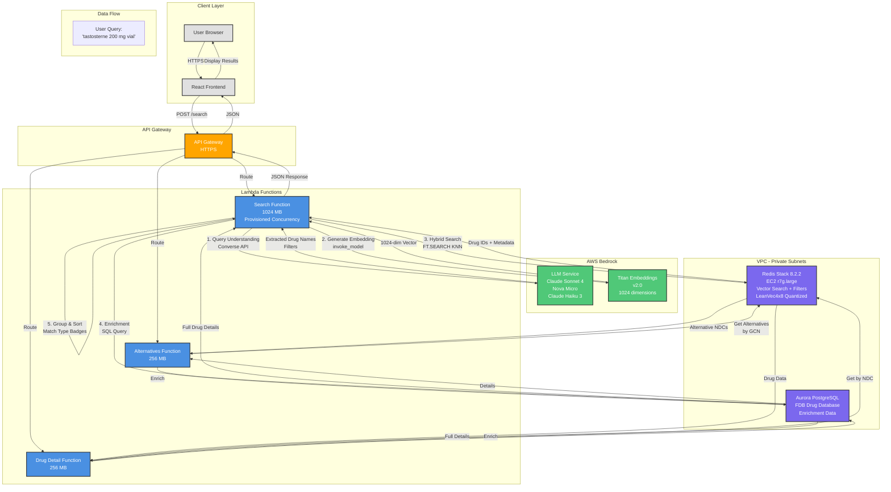

# DAW Drug Search System - Architecture Diagram

## Component Details

### Lambda Functions
- **Search Function**: Main search handler with LLM preprocessing, vector search, and result grouping
- **Alternatives Function**: Finds pharmacological and therapeutic alternatives
- **Drug Detail Function**: Returns full drug information by NDC

### AWS Bedrock Services
- **LLM (Converse API)**: Query understanding, spelling correction, filter extraction
- **Titan Embeddings**: Generates 1024-dimensional vectors for semantic search

### Data Stores
- **Redis Stack 8.2.2**: Vector search index with LeanVec4x8 quantization, hybrid search (KNN + filters)
- **Aurora PostgreSQL**: FDB drug database for enrichment (indications, contraindications, etc.)

### Performance Optimizations
- **Provisioned Concurrency**: Pre-warmed Lambda instances (zero cold starts)
- **1024 MB Memory**: 2x CPU power for faster processing
- **LeanVec4x8 Quantization**: 3x memory reduction in Redis
- **Multi-drug Search**: Individual vector searches per drug for better recall

