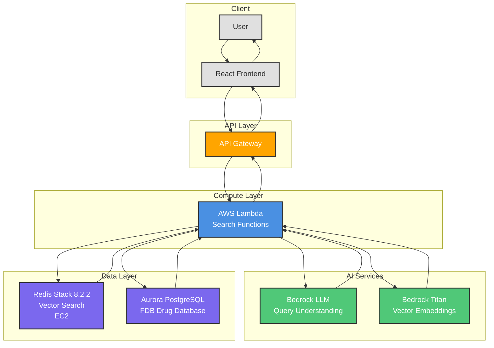

# DAW Drug Search System - High-Level Architecture

## High-Level Components

### Client Layer
- **React Frontend**: User interface for drug search
- **User**: End users (healthcare providers)

### API Layer
- **API Gateway**: HTTPS endpoint, request routing, CORS handling

### Compute Layer
- **AWS Lambda**: Serverless functions for search, alternatives, and drug details
  - Provisioned Concurrency (zero cold starts)
  - VPC-connected for secure database access

### AI Services
- **Bedrock LLM**: Natural language query understanding
  - Spelling correction
  - Medical terminology expansion
  - Filter extraction
- **Bedrock Titan**: Vector embeddings (1024 dimensions)
  - Semantic similarity search

### Data Layer
- **Redis Stack 8.2.2**: Vector search engine
  - Hybrid search (KNN + filters)
  - LeanVec4x8 quantization
  - Self-managed on EC2
- **Aurora PostgreSQL**: Drug database
  - FDB drug information
  - Enrichment data (indications, contraindications, etc.)

## Data Flow

1. **User Query** → Frontend → API Gateway
2. **Query Understanding** → Lambda → Bedrock LLM
3. **Embedding Generation** → Lambda → Bedrock Titan
4. **Vector Search** → Lambda → Redis Stack
5. **Data Enrichment** → Lambda → Aurora PostgreSQL
6. **Results** → Lambda → API Gateway → Frontend → User

